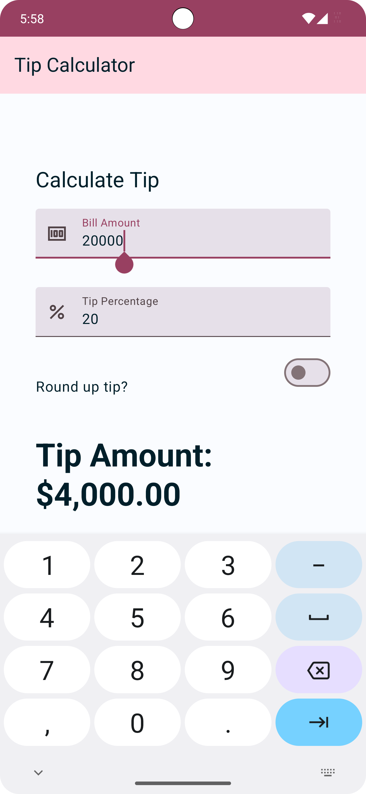
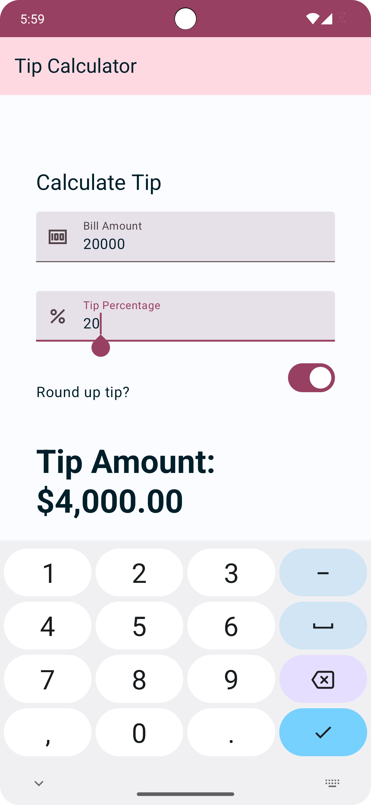

# 💸 Tip Time App

This is a **tip calculation app** built using **Jetpack Compose**, developed as part of learning exercises in **Android Basics with Compose**.

---

## 📜 Overview
The **Tip Time App** helps users **calculate the correct tip amount** based on custom percentage inputs. It demonstrates key principles in **Jetpack Compose UI**, **state management**, and **real-time calculations**.

---

## 🚀 Features
- 🖩 Enter **bill amount** and **custom tip percentage**.
- 🔘 Toggle **round-up tip** for easy calculation.
- 🌙 Supports **light and dark mode**.
- 🧮 **Instant tip calculation** updates in real-time.
- 🎨 Implements **Material Design 3** theming.

---

## 🛠️ Tech Stack
- **Kotlin** 🧑‍💻
- **Jetpack Compose** 💡
- **State Management (`remember`, `mutableStateOf`)** ⚡
- **Android Studio** 🏗️

---

## 📷 App Screenshots

<table>
  <tr>
    <td></td>
    <td></td>
    <td></td>
  </tr>
</table>

---

## ✅ Automated Testing

As part of the learning process in **Android Basics with Compose**, this project now includes **automated UI tests** written using **Jetpack Compose Testing APIs**. These tests help ensure the **accuracy and reliability** of the app's user interface and user interactions.

### 🧪 What’s Covered
- **UI Testing with Compose Test APIs**: Simulates user input and checks UI responses.
- **Node Matching**: Finds composables using `hasText()`, `hasContentDescription()`, etc.
- **State Verification**: Confirms that the correct output is shown based on inputs.
- **Test Structure**: Organized with proper `@Test` functions using `createAndroidComposeRule`.

### 📂 Example Test
```kotlin
@Test
fun calculate_20_percent_tip() {
    composeTestRule.setContent { TipTimeTheme { TipTimeScreen() } }

    composeTestRule
        .onNodeWithText("Bill Amount")
        .performTextInput("10")

    composeTestRule
        .onNodeWithText("Tip (%)")
        .performTextInput("20")

    composeTestRule
        .onNodeWithText("Tip Amount: $2.00")
        .assertExists()
}
```
---